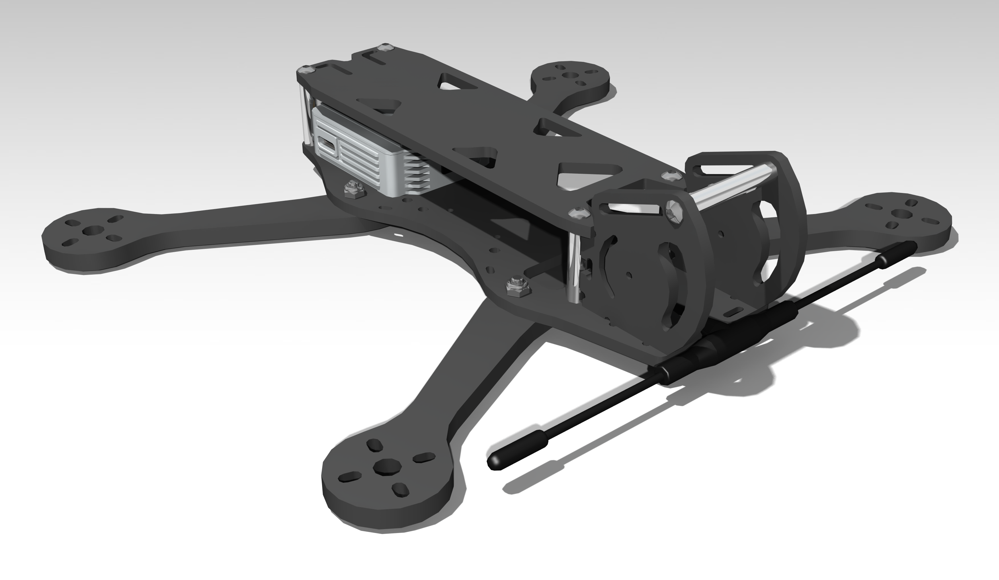

DAF5 (Drone Argentino de Freestyle)
===================================

DAF5 is a freestyle frame designed by [Madius](https://www.youtube.com/@MadiusYT).
There are currently two versions of this frame. This repository contains the design files and additional instructions for both of them.

DAF5 v2
-------

[Design files and documentation](v1/README.md).

DAF5 v1
-------

[Design files and documentation](v2/README.md).