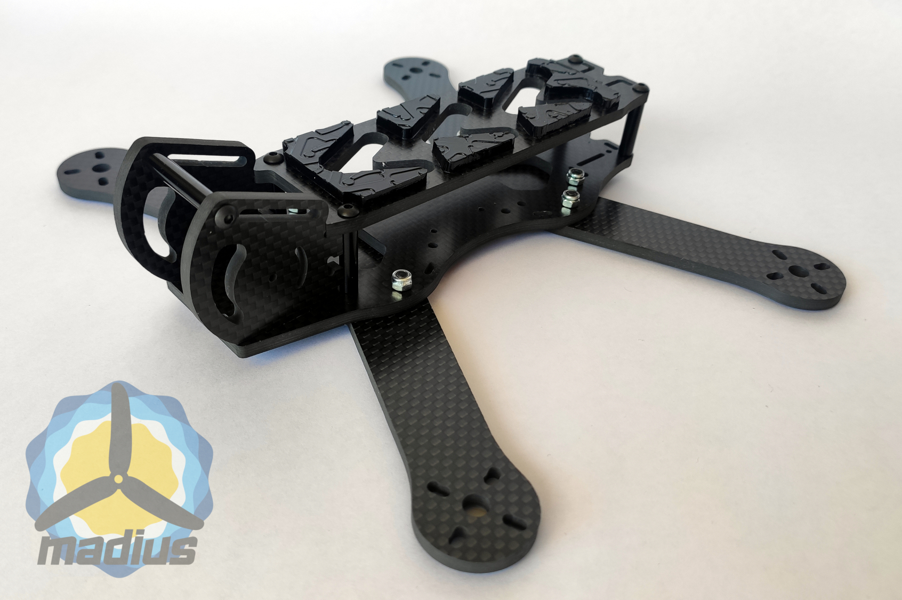
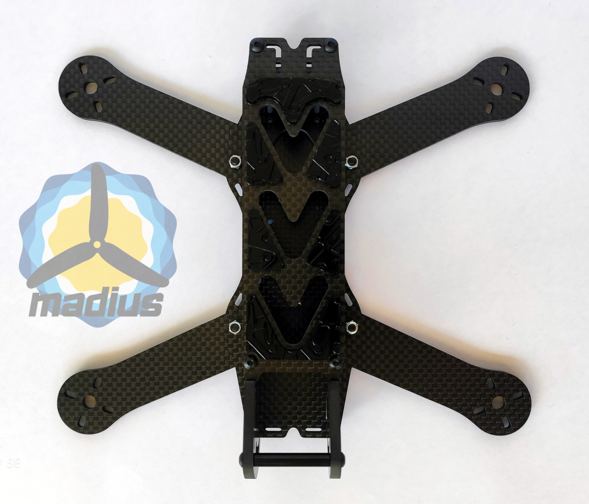
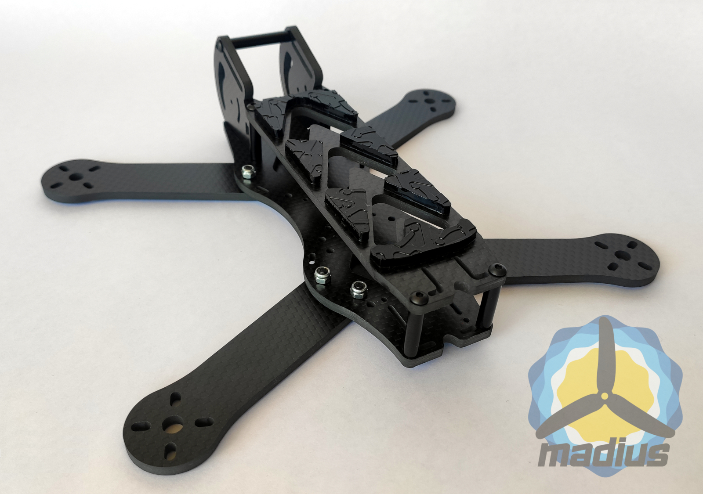
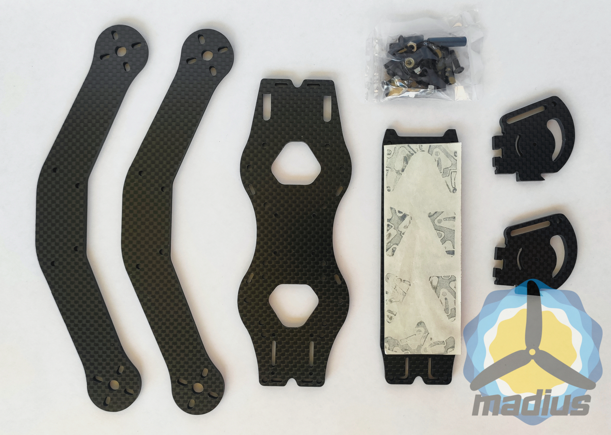
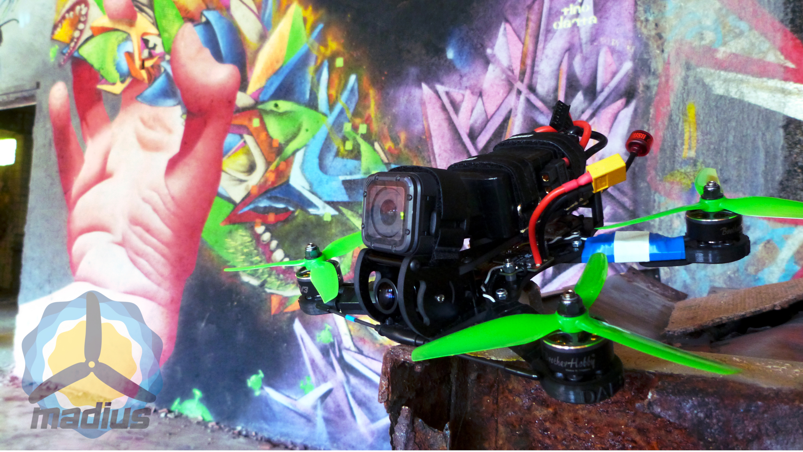
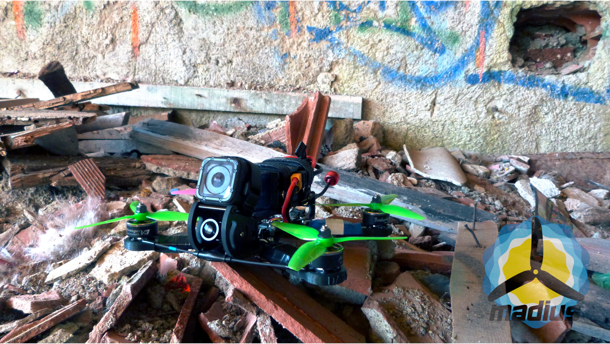
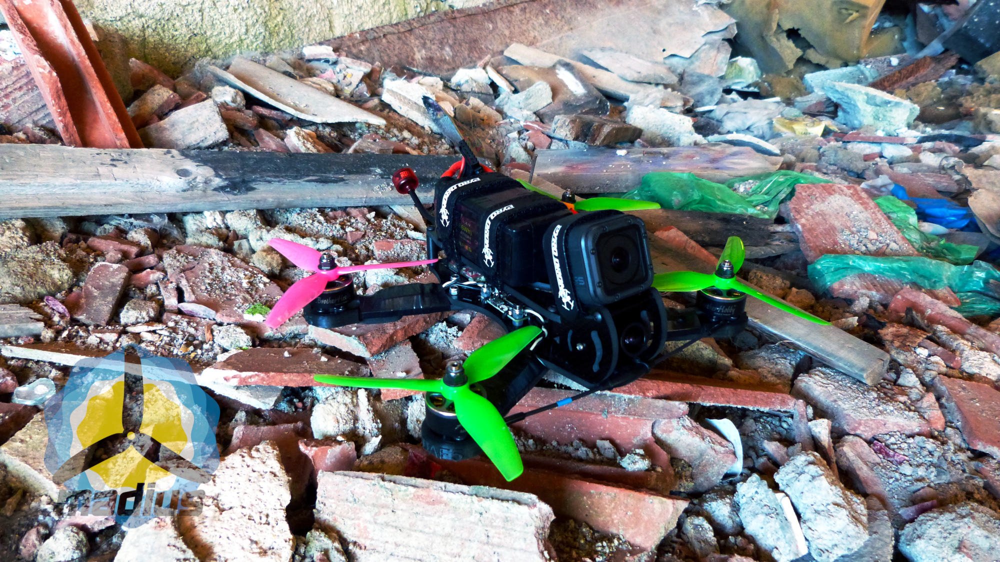

DAF5 v1
=======

[Presentation video](https://www.youtube.com/watch?v=zphxMQCKENU)

**Files** (Click "Download as..." to download)

- [Design files](all_carbon_fiber_4mmV5.dxf)
- [Bill of Materials](BOM.txt)
- [Specifications](specs.txt)

Images
------

### Assembly

### Parts

### Build

